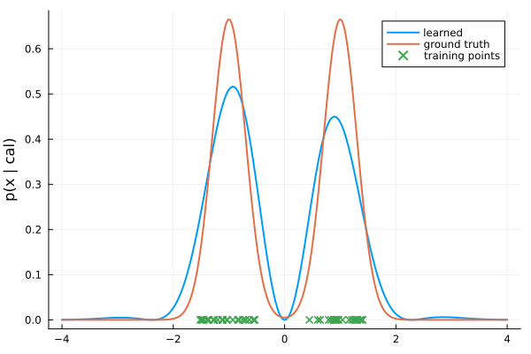
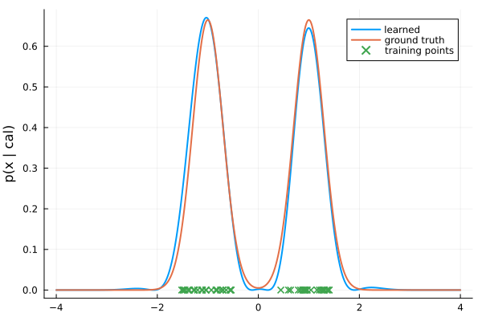
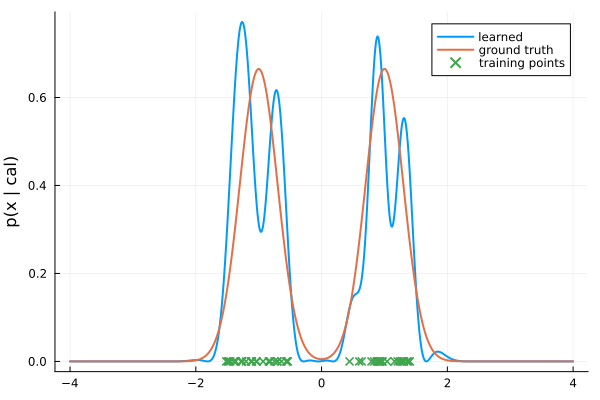

# SOS Kernels
Reproducing experiments from "Non-parametric Models for Non-negative Functions" ([arxiv](https://arxiv.org/abs/2007.03926)).

## Quick Start
This repo was tested with Julia 1.12.1. After cloning the repo, instantiate the environment.

In the shell:
```
julia --project
# press `]` to enter `(SOSKernels) pkg>` mode.
instantiate
```

This will install all required packages. An unfortunate dependency is [MOSEK](https://www.mosek.com/products/academic-licenses/); open source tools like Clarabel simply don't work for these problems. Follow the link to request a free academic license.

## Experiments
### Density Estimation
To run from the Julia REPL:
```julia
include("experiments/density_estimation.jl")
```

The model is, in general, quite sensitive to the choice of kernel (and regularization) parameters. For example:

  $\sigma = 1$  |  $\sigma = 0.6$  |  $\sigma = 0.3$
:-------------------------:|:-------------------------:|:-:
 |  | 

Note that I had to manually tune the regularization term. The $\sigma = 1$ case (from the paper) really isn't so great; the smoothness priors override the function. $\sigma=0.6$ seems to be a sweet spot, while decreasing $\sigma$ any smaller leads to big oscillations. This is a frustrating part of kernel estimation: it finds an "optimal" representation that is highly sensative to the choice of parameters.

Opportunity: a better way to set kernel parameters.